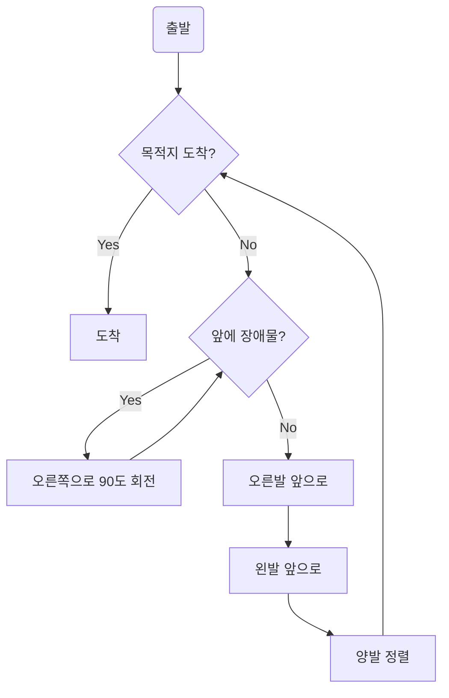

***

## 1주차 1차시 JS study 과제 (박한백)

### [1. 프로그래밍](#1장)

### [2. JS란](#2장)

### [4. 변수](#4장)


***
# 1장

### 2족 보행 로봇이 있습니다. 해당 로봇에 대한 걷다라는 기능을 디자인 해보세요.


***
# 2장

### 1. Ajax란?
* Asynchronous Javascript And XML의 약자

* 자바스크립트를 이용해서 서버와 브라우저가 비동기 방식으로 데이터를 교환할 수 있는 기능.

* 서버와 브라우저가 자바스크립트를 이용해서 비동기로 데이터를 교환하게 해줌

* 서버에서 데이터 받아오는 시간에 처리할 수 있는거 먼저 할 수 있게 해주는 듯


### 2. jQuery란?
* 기존의 자바스크립트 문법에서 사용하는 이름이 긴 함수들을 짧고 간단하게 쓸 수 있게 해주는거

### 3. V8엔진이란?
* 자바스크립트 엔진 중 하나.

* 구글이 개발함

* node js 런타임, 크롬에서 사용됨

* 자바스크립트를 컴파일러로 번역하게 해줌


### 4. Nodejs란?
* 이거 덕분에 js를 서버에서 사용할 수 있다고 한다.

* V8엔진으로 동작하는 자바스크립트 런타임이다.

* V8엔진으로 동작한다길래 컴파일러로 번역되는줄 알았는데, 인터프리터도 사용한다고 한다.

### 5. SPA프레임워크란?
* Single Page Apllication의 약자

* react, vue, angular같은거를 말한다고 한다.

* 페이지 이쁘게 만드는거 쉽게 해주는 프레임워크.


### V8엔진에 대해서 정리해 보시오
* 오픈소스다.

* 컴파일러로 동작한다.

* js를 빠르게 해준다고 한다.

* 메모리를 자동으로 관리해 준다고 한다. 

* 요놈 덕분에 여기 저기서 js를 사용하게 된 것 같다.

* nodejs에도 v8엔진이 사용 됐고, chrome에도 사용 됐는데 둘이 사용처가 다른거 아닌가? 싶어 찾아보니 똑같은 엔진으로 서버도 지원하고, 브라우저도 지원한다고 한다.

***
# 4장

### 아래의 코드들을 실행한 값을 알아오시오. 그리고 그 이유도


```javascript
console.log(a);
var a;
a = 11;
console.log(a);
```

출력:
```console : 
undefined
11 
```

```javascript
console.log(a);
a = 10;
var a;
console.log(a);
```
출력:
```console : 
undefined
10
```

각각 a라는 변수 선언 위치, 10을 대입하는 위치가 다르지만, 같은 출력 형식을 보이는 것을 보니 JS의 호이스팅은 대입문은 무시하고 선언문만 찾아서 프로그램에 오류가 나지 않게 해주는 것 같다.

찾아보니 함수 내에 존재하는 모든 선언문들을 해당 함수의 최상단으로 끌어 올려준다고 한다.
### 헝가리안 케이스란?

* 앞에 변수의 자료형 + 파스칼 표기법으로 변수를 만드는 것

* 앞에 붙는 접두어는 구글에 있다

* 파이썬 쓰는 사람한테는 필요없는 표기법인 것 같다
